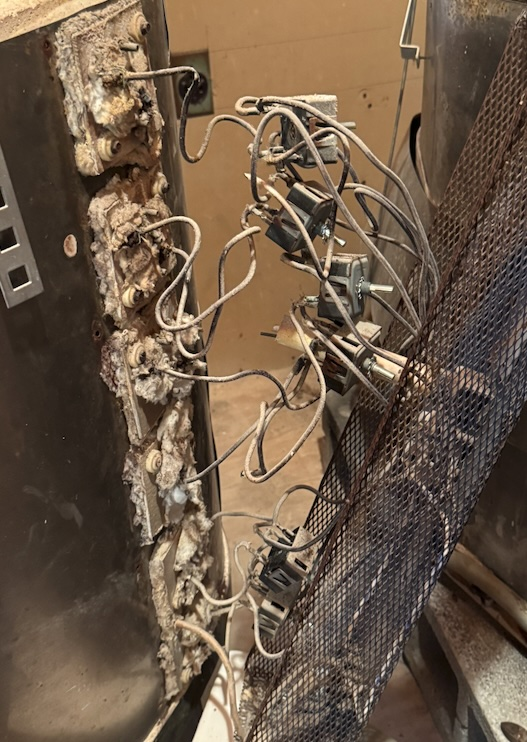
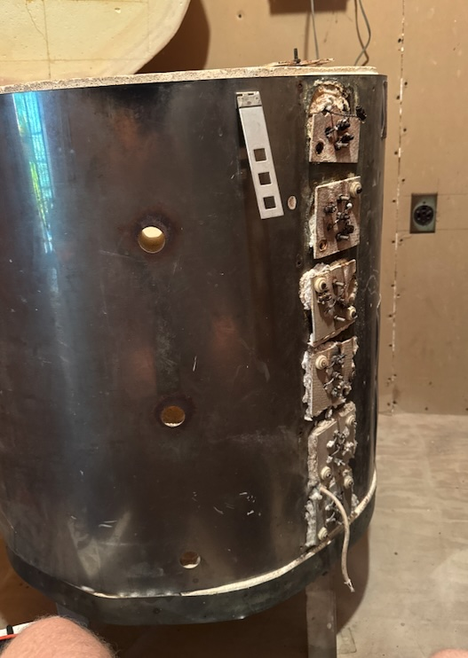
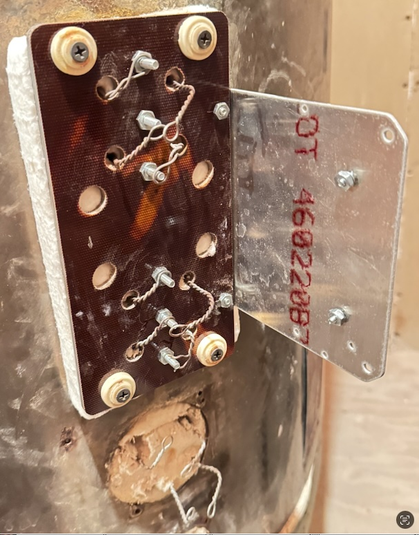
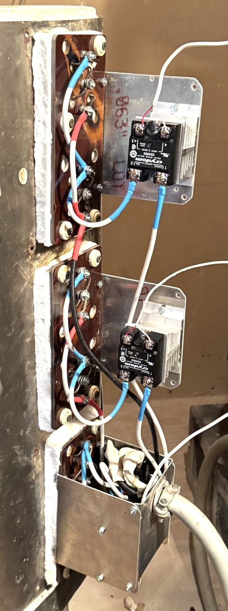
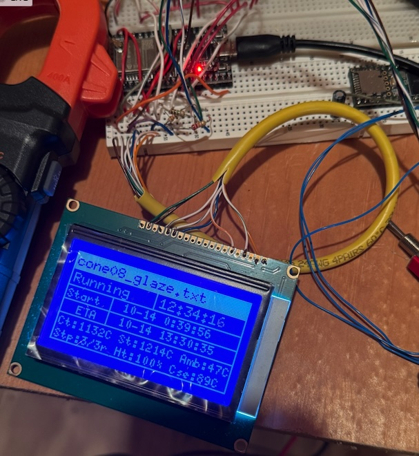

# Kiln controller

This project started with the restoration and modernization of a Crusader 274S kiln that was in disrepair, with only one or two functional elements.

## Element repair and re-wiring

Before starting on control software, the kiln needed a freshening up of its elements. The Majority of the connections from the original controls, had corroded away to the element contacts and had to be replaced. The original wiring supported 12 elements in six groups of two with each pair wired in series. The new wiring utilized 60 amp solid-state relays to control three groups of four where each group of four consisted of a series of two in parallel with each other.

The original wiring was removed to reveal the following crusty mess. 

Some high temp glass fiber board was sourced and milled down into a faceplate that would cover two of the prior wiring ports (each port consisted of four holes for two element to connect). Some elements were fully removed and reworked to have fresh connection points twisted. Glass fiber batting was cut to fit between the glass board and the kiln exterior.

Eventually the SSRs and heatshinks were mounted and wired up to control ~15A worth of load. The completed re-wiring is shown below.

## Control software

Initially, [Saur0o0n's PIDKiln](https://github.com/Saur0o0n/PIDKiln) seemed perfect, so it was built and implemented. Since my kiln is not in WiFi range, this was not ideal. I wanted a longer range telemetry link, and also more GPIO than the esp32 offered (especially given the full utilization already present within PIDKiln. 

I did have a successfull firing using PID kiln, although the lack of compensation on the K type converter affected the end results by reaching much higher temperatures than expected. It did serve as a good stress test of the new wiring.

This led to a new project based on a Teensy 3.6 that was laying around. Plenty of GPIO and very convenient. PIDKiln also uses MAX3185's that aren't that don't have compensation built in for the increase in non-linearity that K type TC's have at temperatures over 1000 deg C. For this reason I went with a 4 channel MCP960* based board from [PlayingWithFusion](https://www.playingwithfusion.com/productview.php?pdid=120). I have laid out some PCBs for these chips before and I think they offer a nice product.

This is the code that runs on the teensy. Data is logged to and SD card for reviewing firing results. Profiles to fire are loaded from the card as well. There is also groundstation code that runs on a FeatherM0 SAMD21 board and interfaces with a PC for remote control and telem logging. 

## Improvements to be made
* control the bottom element separately for more even temperature throughout the kiln
* Add ability to add and save a firing profile from the groundstation
* Screen / minimal UI with buttons to fire a preset without needing the groundstation.
* Remote download of logfiles from SD card to groundstation to avoid fiddling with a microSD card
* make a PCB for it
* make an enclosure for it
* oof
